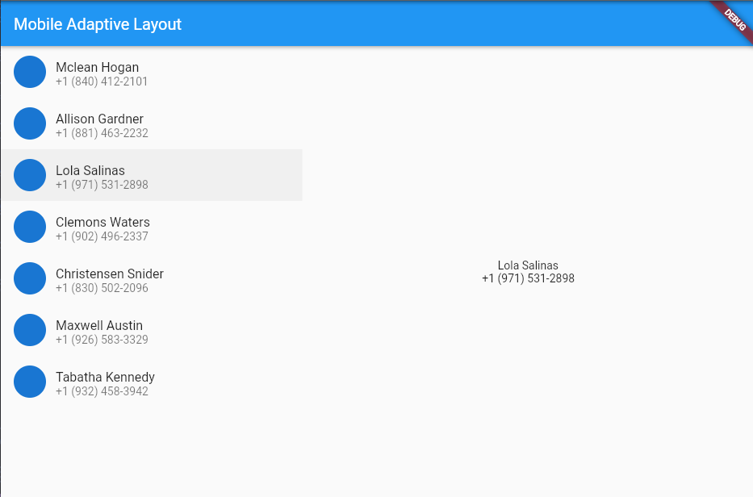

# Project adaptive_layout

Project ini menerapkan design yang adaptive pada aplikasi android ini. Adaptive merupakan suatu design yang dimana letak layout akan di tentukan sesuai dengan besar ruang pada layar device aplikasi. Layout akan di sesuaikan sewajarnya bagaimana penempatan yang sesuai untuk ruang layar yang kecil atau besar.

## Hasil saat Layar memiliki lebar yang kecil

## Hasil saat Layar memiliki lebar yang lebih besar

## Bukti Kerja

This project is a starting point for a Flutter application.

A few resources to get you started if this is your first Flutter project:

- [Lab: Write your first Flutter app](https://docs.flutter.dev/get-started/codelab)
- [Cookbook: Useful Flutter samples](https://docs.flutter.dev/cookbook)

For help getting started with Flutter development, view the
[online documentation](https://docs.flutter.dev/), which offers tutorials,
samples, guidance on mobile development, and a full API reference.
